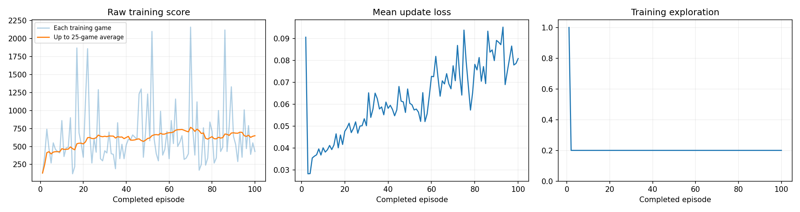
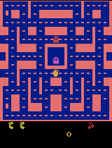
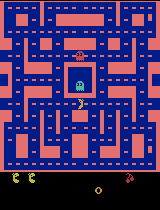

# Assignment 2 — Training a Ms. Pac-Man Agent with a DQN

Class 3 assignment. A Deep Q-Network is trained on `ALE/MsPacman-v5` with the supplied notebook,
then evaluated against its own untrained starting point under identical settings. I ran the
experiment three times, changing the learning rate each time.

Starter notebook adapted from [pepealonso95/pacman-dqn](https://github.com/pepealonso95/pacman-dqn).

> **Headline result: training reliably made the agent worse, and the reason is not the learning
> rate.** In my final run the evaluation mean fell from **492 to 304**, with all five seeds
> regressing — while the *training* score over the same run rose from 130 to a peak of 691. That
> contradiction is the real finding, and it points at the exploration setting rather than the step
> size. See [The finding](#the-finding-training-improved-while-evaluation-collapsed).

## Open and run

- **Colab:** click the badge, choose Runtime → Change runtime type → T4 GPU, then Runtime → Run all.
  The first cell installs every package. My three values are already set in section 1.
- **Local Jupyter / VS Code:** clone this repo, select a Python 3.11–3.13 kernel, `pip install -r
  requirements.txt`, and Run All. Keep `pacman_player.py` beside the notebook for the local
  floating gameplay window.

## My three hyperparameters

These are the settings for the headline run, the notebook in this repository, and everything in
`results/` outside the subfolders.

| Setting | Value | Why I chose it |
|---|---|---|
| Exploration | `0.20` | Keeps one training move in five random after warm-up. Ms. Pac-Man rewards nothing for standing still, so the agent needs forced variety to keep meeting pellets and ghosts it would not choose itself. I held it at the reference value across all three runs so the learning rate stayed the only variable. **This is the setting my results now implicate — see the next experiment.** |
| Episodes | `100` | My first run used 5 episodes and produced only 388 learning updates, far too few to conclude anything. 100 episodes gives ~57,500 decisions and ~14,100 updates, enough for a real before/after comparison. |
| Learning rate | `0.002` | Chosen in response to my previous run. At `0.01` the loss spiked to 16.09 in episode 2 and the agent ended up worse than untrained, which looked like too large a step. `0.002` is a fifth of that but still 20× the 0.0001 reference, so the experiment stayed informative rather than reverting to the default. |

Every other setting is the notebook's fixed classroom default. Evaluation settings are untouched
in all three runs: the same five seeds (101, 202, 303, 404, 505), 5% exploration, and the same
3,000-decision cap, applied identically before and after training.

## What I expected

I predicted that the smaller step would repair the damage `0.01` had done, and that **improvement
would continue** through training rather than stalling early — a training score that kept climbing
and an evaluation mean that finally landed above the untrained baseline of 492.

## What I observed

The training half of that came true, then faded. The evaluation half did not happen at all.

### All five before/after evaluation scores

Same five seeds, 5% exploration, same step cap, untrained network as baseline.
Full data: [`results/comparison.json`](results/comparison.json).

| Seed | Untrained | Trained | Change |
|---:|---:|---:|---:|
| 101 | 350 | 210 | −140 |
| 202 | 500 | 380 | −120 |
| 303 | 320 | 270 | −50 |
| 404 | 800 | 430 | −370 |
| 505 | 490 | 230 | −260 |
| **Mean** | **492.0** | **304.0** | **−188.0** |
| Median | 490 | 270 | −220 |

**Every single seed regressed.** Both mean and median fell. There is no outlier to argue about and
no reading of this table that shows improvement.

### Training plot

The loss panel confirms the step size was fixed. Mean update loss stays between **0.028 and 0.095
for the whole run** — no spike, no `NaN`. At `0.01` the same panel peaked at 16.09. Loss does drift
upward from 0.03 to about 0.08 across training, which is expected as the agent's value estimates
grow to match the larger returns it is seeing.

The score panel is where my prediction looked correct:

| Episode | 25-game average training score |
|---:|---:|
| 1 | 130.0 |
| 10 | 469.0 |
| 25 | 610.0 |
| 50 | 611.6 |
| 60 | **691.2** |
| 75 | 680.4 |
| 100 | 649.2 |

Training score climbs steadily to a peak of 691 near episode 60, then eases back to 649 — improvement
that continued much further than in either earlier run, but did not sustain to the end. The best
single training game scored **2,160** at episode 70. Unlike my `0.01` run, this rise is not just the
warm-up artefact: it keeps climbing long after exploration has settled at 0.20 by episode 2.

### The finding: training improved while evaluation collapsed

These two facts have to be reconciled:

| | Exploration | Mean score |
|---|---|---|
| Trained agent, during training | 0.20 | ~650–690 |
| Trained agent, at evaluation | 0.05 | **304** |
| Untrained network, at evaluation | 0.05 | 492 |

The agent scores well when one move in five is random, and badly when only one in twenty is. Its
own untrained starting weights beat it at 5%. The explanation this points to is that the learned
greedy policy is **degenerate** — it stalls, loops, or commits to a direction — and the 20% random
moves during training were doing the work of actually moving it around the maze. Evaluation removes
that crutch and exposes the policy underneath.

I want to be precise about confidence: this is inference from the training/evaluation gap, not
something I directly measured. The check that would settle it is to load a saved checkpoint and
print the distribution of `argmax` actions over a batch of states. If the agent has collapsed onto
one or two of the nine joystick moves, the explanation holds.

### Gameplay

Every clip is the first 20 seconds at 4× speed, playing twice before stopping. The trained clip is
the best of the five evaluation games, chosen on full-game score.

| Untrained (baseline) | Trained, best of five |
|---|---|
|  |  |

Intermediate samples every 25 episodes ([`results/demo_scores.json`](results/demo_scores.json)),
all on seed 101, whose untrained baseline was 350:

| Episode 25 | Episode 50 | Episode 75 | Episode 100 |
|---|---|---|---|
|  |  |  |  |
| 480 | 180 | 350 | 210 |

These samples run at evaluation exploration, and they never establish a trend above the 350
baseline — consistent with the final score of 210 on that seed, and with the gap described above.

### Actual training budget

From [`results/training_summary.json`](results/training_summary.json) and [`results/config.json`](results/config.json):

| | |
|---|---|
| Status | `completed` — not interrupted |
| Episodes completed | 100 of 100 requested |
| Total decisions | 57,529 |
| Learning updates | **14,133** |
| Elapsed training time | 367.4 s (6.1 min), including periodic sample capture |
| Hardware | CPU (Colab, Linux x86-64), PyTorch 2.9.0+cpu, Python 3.13.15 |

The run reported CPU rather than GPU. It made little practical difference — the Atari emulator is
single-threaded CPU work that dominates the loop — but the hardware is recorded honestly as CPU.
Per-episode data is in [`results/training.csv`](results/training.csv).

## All three runs

Every run used the same five evaluation seeds, 5% evaluation exploration, and training exploration
0.20. The untrained baseline is identical across all three because `SEED = 42` is fixed.

| Run | Learning rate | Episodes | Updates | Baseline mean | Trained mean | Evidence |
|---|---:|---:|---:|---:|---:|---|
| Setup check | 0.0001 | 5 | 388 | 492 | 730 | [`results/setup_check_5ep/`](results/setup_check_5ep) |
| Second | 0.01 | 100 | 13,488 | 492 | 408 | [`results/lr_0.01_100ep/`](results/lr_0.01_100ep) |
| **Headline** | **0.002** | **100** | **14,133** | **492** | **304** | `results/` |

The 730 in the first row is not a real result: that run had 388 updates, its gain came from a single
seed, and its median fell. The two comparable 100-episode runs are the second and third, and cutting
the learning rate by five moved the evaluation mean **down** by 104, not up. Combined with a loss
curve that shows no instability left to fix, that is what convinced me the step size is no longer
the binding problem.

## How the agent works, in plain language

- **Observations.** The agent never sees the game's memory or a list of objects. It sees **four
  consecutive game screens**, shrunk to 84 × 84 grayscale images and stacked. Four frames rather than
  one is what makes motion visible: a single still image cannot tell you whether a ghost is
  approaching or retreating.
- **Actions.** It picks one of the **nine joystick moves** — eight directions plus no-op — and holds
  it for four emulator frames, so one decision covers about a fifteenth of a second.
- **Rewards.** The reward is the **game points** earned in that interval: pellets, power pellets,
  edible ghosts, fruit. During training these are clipped to [−1, 1] so no single event dominates an
  update, but every score in this README is the raw, unclipped game score.
- **Learning.** Each experience goes into a replay memory. Every four decisions the agent samples 32
  past experiences at random and nudges its value estimates toward the reward received plus the
  discounted value of the next state, judged by a slowly-updated target network. Random sampling
  breaks the correlation between consecutive frames; the target network stops the agent chasing its
  own moving estimate.

## One limitation

**Training score is not a valid measure of what the agent has learned, and for two runs I let it
look like one.** The agent is trained and scored under different exploration rates — 0.20 against
0.05 — so a policy that is bad on its own can post good training numbers as long as random moves keep
rescuing it. My training curve peaked at 691 in exactly the run whose evaluation was worst. Nothing
in the score panel warns you about this; only the held-out evaluation does.

The second limit is on the conclusion itself. I have one run per learning rate and one seed, and my
evaluation spans five games whose scores range 70–840. That is enough to say all three runs failed to
beat the baseline, but not enough to rank 0.01 against 0.002 with any confidence — the 104-point gap
between them is well within the variance of five games.

## My next experiment

**Change only `EXPLORATION`, from 0.20 to 0.05.** The learning rate stays at 0.002 and the budget
stays at 100 episodes.

I am moving off the learning rate because I have now tested it twice and it is not where the evidence
points. Going from 0.01 to 0.002 removed the loss spike completely and improved every training-side
measure, and the evaluation mean still fell. A third value would be tuning a variable that is already
behaving.

What the data does point at is the mismatch between how the agent is trained and how it is judged.
It collects experience at 20% randomness and is scored at 5%, and the size of that gap — ~690 during
training against 304 at evaluation — is the single largest unexplained number in this report. Setting
training exploration to 0.05 makes the two match, so the replay memory fills with the kind of states
the agent will actually face when scored, and its greedy policy gets trained on its own consequences
rather than on outcomes that random moves produced.

The concrete prediction: if the crutch explanation is right, training score should **drop** toward
the 300s while the evaluation mean **rises** toward or above 492. Seeing training and evaluation move
in opposite directions again, but the other way round, would confirm the diagnosis. If both stay low,
the problem is capacity rather than exploration, and the 5,000-transition replay memory — about ten
episodes of experience — is the next thing I would raise.

## Repository contents

| Path | What it is |
|---|---|
| [`pacman_dqn.ipynb`](pacman_dqn.ipynb) | The executed notebook for the headline run |
| [`results/comparison.json`](results/comparison.json) | All five before/after scores and means |
| [`results/config.json`](results/config.json) | Hyperparameters, hardware, exact package versions |
| [`results/training.csv`](results/training.csv) | One row per training episode |
| [`results/training_summary.json`](results/training_summary.json) | Episodes, decisions, updates, elapsed time, status |
| [`results/baseline.json`](results/baseline.json) | Untrained evaluation detail |
| [`results/demo_scores.json`](results/demo_scores.json) | Scores for the four intermediate samples |
| [`results/training_dashboard.png`](results/training_dashboard.png) | Score, loss, and exploration curves |
| `results/untrained.gif`, `results/trained_best.gif` | Baseline and best trained gameplay |
| `results/episode_0025.gif` … `episode_0100.gif` | Intermediate gameplay every 25 episodes |
| [`results/lr_0.01_100ep/`](results/lr_0.01_100ep) | Full evidence for the 0.01 run |
| [`results/setup_check_5ep/`](results/setup_check_5ep) | Full evidence for the 5-episode setup check |
| [`pacman_player.py`](pacman_player.py) | Optional floating gameplay window for local runs |
| [`requirements.txt`](requirements.txt) | Dependencies for a local run |

### Where the model checkpoints are

The playback checkpoints — `untrained.pt`, `trained.pt`, and `episode_0025/0050/0075/0100.pt`, 6.7 MB
each — are **not committed**. They are excluded by `.gitignore` along with the whole `pacman_runs/`
folder, and are kept in the run ZIPs stored locally (`20260910_060222_302005.zip` for the headline
run, `20260910_055110_655234.zip` and `20260910_052510_490439.zip` for the earlier two). They are
needed only to replay a saved agent; every number and image in this README comes from the JSON, CSV,
PNG, and GIF files committed above.
